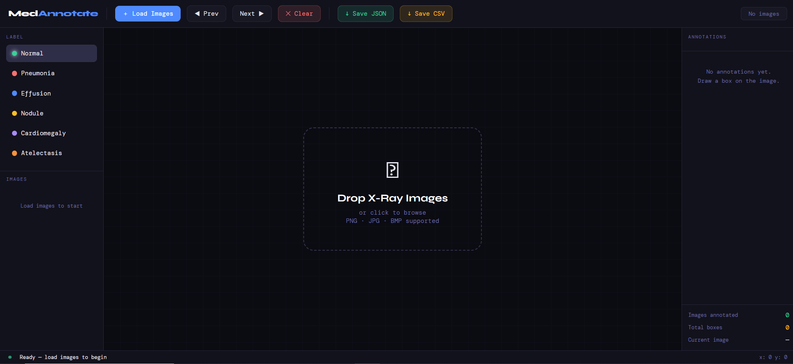

# Medical Image Annotator

A web-based tool for annotating medical images (X-rays) with bounding boxes.

## Screenshot



## Features

- Draw bounding boxes on medical images
- Multiple label types (Normal, Pneumonia, Effusion, Nodule, Cardiomegaly, Atelectasis)
- Export annotations as JSON or CSV
- Keyboard navigation (← → arrows)
- Thumbnail gallery with annotation badges

## Quick Start

1. Open `index.html` in a web browser
2. Drag & drop images or click to load
3. Select a label and draw boxes on images
4. Export annotations using the save buttons

## Usage

- **Draw box**: Click and drag on image
- **Change label**: Click label buttons in left sidebar
- **Navigate**: Use Prev/Next buttons or arrow keys
- **Delete**: Click ✕ on annotation or use Delete/Clear button
- **Export**: Save JSON or CSV files

## File Format

### JSON Output
```json
{
  "metadata": {...},
  "annotations": [
    {
      "image": "filename.jpg",
      "boxes": [{"label": "Pneumonia", "bbox": [x1,y1,x2,y2]}]
    }
  ]
}